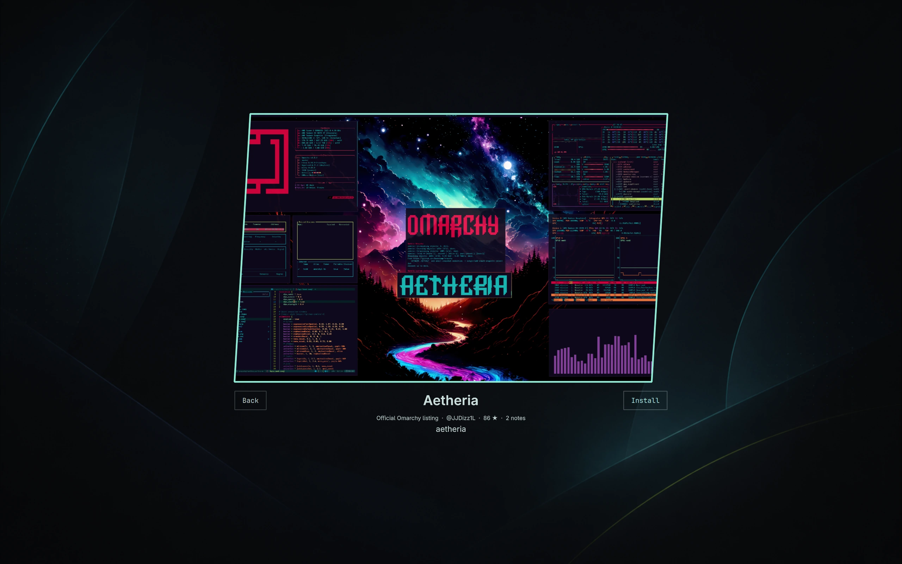

# Omarchy Theme Manager

Browse, install, and remove themes from Omarchy's full-screen theme switcher.
The plugin preserves the native carousel and leaves the background picker
unchanged.



## Features

- Search a cached catalog with previews, authors, stars, notes, and an official
  Omarchy listing badge.
- Install through `omarchy theme install` after explicit confirmation.
- Uninstall non-active themes from `~/.config/omarchy/themes` through
  `omarchy theme remove`.
- Block stock-theme collisions, installed repositories, and removal of the
  active theme.
- Deduplicate catalog entries by canonical GitHub repository URL, so unrelated
  themes with the same name remain distinct.

## Requirements

- Omarchy 4.0 (Quattro)
- `curl`, `git`, `jq`, and GNU core utilities from the standard Omarchy install

The plugin has no install hooks, elevated privileges, or additional runtime
dependencies.

## Install

```bash
omarchy plugin add https://github.com/mtolhuys/omarchy-theme-manager.git --enable
```

The plugin intentionally declares `omarchy.clonedFrom: omarchy.image-picker`.
This routes the existing theme-switcher command to Theme Manager; disabling or
removing it restores Omarchy's built-in picker.

## Use

Open the regular Omarchy theme switcher.

- Choose **Browse themes** or press `Ctrl+B` to open the catalog.
- Type to search, use the arrow keys to navigate, and press `Enter` to install.
- Select an installed theme and choose **Uninstall**, or press `Delete`.
- Press `Escape` to clear a search, leave the catalog, or close the switcher.

Omarchy clones and applies an installed theme immediately after confirmation.
The active theme must be changed before it can be removed.

Catalog metadata is cached for six hours. A previous valid cache remains usable
when a refresh fails. See [CATALOG.md](CATALOG.md) for source, trust, and
deduplication details.

## Security

Omarchy shell plugins run unsandboxed with the current user's permissions.
Review plugin and theme sources before enabling them.

Theme Manager does not request elevated privileges, write to
`/usr/share/omarchy`, or build shell commands from remote data. It accepts only
normalized GitHub repository URLs, passes process arguments separately to
Omarchy's CLI, and treats catalog text as bounded plain text. Remote downloads,
record counts, and the QML payload have hard limits; preview images are loaded
only from allowlisted GitHub hosts and paths. A catalog entry or official badge
is discovery metadata, not a security endorsement.

## Development

Run the complete local check from the repository root:

```bash
npm run quality
```

It runs the model tests, ESLint, ShellCheck, shfmt, `qmllint`, Prettier, and
Omarchy's plugin validator. The tools are standard Arch packages; there are no
npm dependencies or generated `node_modules` required by the project.

When developing through a symlink outside `~/.config/omarchy/plugins`, run
`omarchy-shell shell rescanPlugins` after changes. Read [UPSTREAM.md](UPSTREAM.md)
before rebasing the derived picker files onto a newer Omarchy release.

## Remove

```bash
omarchy plugin remove io.github.mtolhuys.theme-manager
```

Removing the plugin restores the built-in picker and does not remove themes.

## License

MIT. Picker code derived from Omarchy retains its upstream copyright notice in
[LICENSE](LICENSE).
